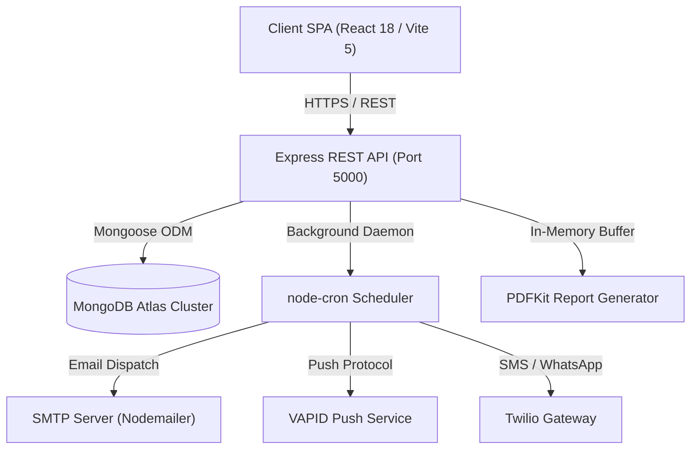

# Trulicare System Architecture

## 🏛️ High-Level System Architecture

---

## 🔐 Request & Security Architecture

1. **Authentication Layer**: JWT tokens delivered via HTTP-Only, `SameSite` cookies or `Authorization: Bearer <token>` headers.
2. **Authorization Layer (RBAC)**: `restrictTo('Pharmacist', 'Doctor', 'Admin')` middleware guards protected routes.
3. **Data Protection Layer**: Passwords hashed with BCrypt (10 rounds). Sensitive PII encrypted at rest using AES-256-CBC getters/setters in `User.js`.
4. **Network Hardened**: Express `helmet` headers, CORS domain filtering, `express-rate-limit` throttles.

---

## 🔄 Cron & Notification Architecture

- `cronService.js` triggers pre-alarm checks every minute (`* * * * *`).
- Patient local timezone resolved dynamically via `Intl.DateTimeFormat` against `user.timezone`.
- Daily intake validated against `AdherenceLog` collection to prevent duplicate alert dispatches.
