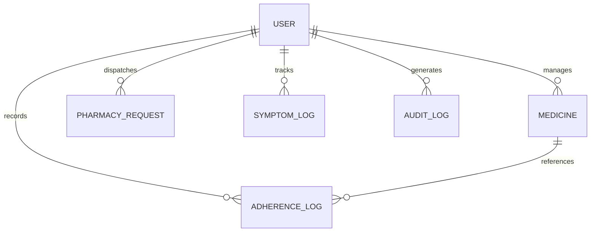

# Trulicare Database Schema & ERD Documentation

## 📊 Entity Relationship Diagram (ERD)

---

## 🗄️ Collections & Indexing Strategy

### 1. `User` Schema
- **Indexes**: `{ email: 1 }` (Unique)
- **PII Encryption**: AES-256-CBC getters & setters applied to `phoneNumber` and `caregiverEmail`.

### 2. `AdherenceLog` Schema
- **Indexes**: `{ userId: 1, date: -1 }`, `{ userId: 1, medicineId: 1, date: 1, timeOfDay: 1 }` (Unique)
- **Purpose**: Tracks intake logs (`Taken`, `Skipped`, `Missed`). Unique compound index prevents duplicate logs per dose slot.

### 3. `PharmacyRequest` Schema
- **Indexes**: `{ userId: 1, requestedAt: -1 }`
- **Purpose**: Queue for patient prescription refill requests. Refill updates restricted via RBAC.
