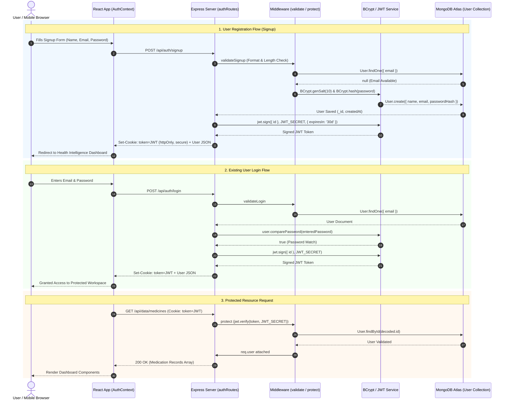

# HealthStock End-to-End Authentication Sequence Diagram

```mermaid
sequenceDiagram
    autonumber
    actor User as User / Mobile Browser
    participant React as React App (AuthContext)
    participant Express as Express Server (authRoutes)
    participant MW as Middleware (validate / protect)
    participant BCrypt as BCrypt / JWT Service
    participant Mongo as MongoDB Atlas (User Collection)

    %% SIGNUP FLOW
    rect rgb(240, 248, 255)
    note over User, Mongo: 1. User Registration Flow (Signup)
    User->>React: Fills Signup Form (Name, Email, Password)
    React->>Express: POST /api/auth/signup
    Express->>MW: validateSignup (Format & Length Check)
    MW->>Mongo: User.findOne({ email })
    Mongo-->>MW: null (Email Available)
    MW->>BCrypt: BCrypt.genSalt(10) & BCrypt.hash(password)
    BCrypt-->>Mongo: User.create({ name, email, passwordHash })
    Mongo-->>Express: User Saved (_id, createdAt)
    Express->>BCrypt: jwt.sign({ id }, JWT_SECRET, { expiresIn: '30d' })
    BCrypt-->>Express: Signed JWT Token
    Express-->>React: Set-Cookie: token=JWT (httpOnly, secure) + User JSON
    React-->>User: Redirect to Health Intelligence Dashboard
    end

    %% LOGIN FLOW
    rect rgb(245, 255, 245)
    note over User, Mongo: 2. Existing User Login Flow
    User->>React: Enters Email & Password
    React->>Express: POST /api/auth/login
    Express->>MW: validateLogin
    MW->>Mongo: User.findOne({ email })
    Mongo-->>Express: User Document
    Express->>BCrypt: user.comparePassword(enteredPassword)
    BCrypt-->>Express: true (Password Match)
    Express->>BCrypt: jwt.sign({ id }, JWT_SECRET)
    BCrypt-->>Express: Signed JWT Token
    Express-->>React: Set-Cookie: token=JWT + User JSON
    React-->>User: Granted Access to Protected Workspace
    end

    %% PROTECTED ROUTE ACCESS
    rect rgb(255, 248, 240)
    note over User, Mongo: 3. Protected Resource Request
    React->>Express: GET /api/data/medicines (Cookie: token=JWT)
    Express->>MW: protect (jwt.verify(token, JWT_SECRET))
    MW->>Mongo: User.findById(decoded.id)
    Mongo-->>MW: User Validated
    MW->>Express: req.user attached
    Express-->>React: 200 OK (Medication Records Array)
    React-->>User: Render Dashboard Components
    end
```
